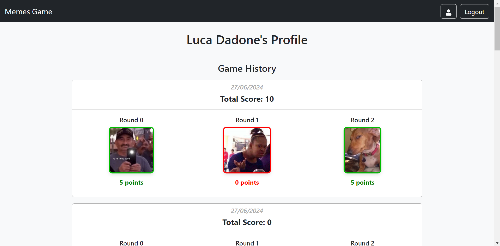

# React Game: What do you meme?

<div style="display: flex; justify-content: center; gap: 10px;">
    
    
</div>


<!--
<div style="display: flex; justify-content: center; gap: 10px;">
    
    
</div>

<div style="display: flex; justify-content: center; gap: 10px;">
    
    
</div>
-->


## React Client Application Routes

- **Route `/`**
  - **Page Content**: *`HomePage`*
  - **Purpose**: This is the main landing page of the application. It provides an overview of the app and its features.

- **Route `/game`**
  - **Page Content**: *`GamePage`*
  - **Purpose**: This page is where users can play the meme game. It loads a series of random memes and allows users to interact with them.
  - **Loader**: `memesLoader` - Fetches random memes from the server to be used in the game.

- **Route `/login`**
  - **Page Content**: *`LoginPage`*
  - **Purpose**: This page allows users to log into their accounts. If the user is already logged in, they will be redirected to the HomePage.

- **Route `/profile`**
  - **Page Content**: *`UserProfilePage`*
  - **Purpose**: This page displays the user's profile information and game history. It shows the details of the games played, including the date, total score, and individual rounds with meme images and scores.
  - **Loader**: `gamesHistoryLoader` - Fetches the user's game history from the server.

- **Route `*`**
  - **Page Content**: *`WrongUrlPage`*
  - **Purpose**: This page is displayed when the user navigates to an undefined URL. It informs the user that the page they are looking for does not exist.

<!--- **Route `/error`**
  - **Page Content**: *`ErrorComponent`*
  - **Purpose**: This is a test page used to generate and display errors for **testing purposes**. It helps in checking the error handling capabilities of the application.
-->
- **Error Handling**: errorElement: *`ErrorPage`* - Displays an error page if there is an issue loading any of the valid routes in the application. It handles also server errors if not handled directly in components.


## Main React Components

- `HomePage` (in `HomePage.js`): Displays the main page of the Meme Game application. Includes a welcome message, an image, and a description of the game. Provides a "PLAY" button that navigates to the game page (`/game`) when clicked.

- `GamePage` (in `GamePage.js`): Renders a game page with a loading indicator while fetching memes data asynchronously. Utilizes `Suspense` and `Await` components from React Router DOM for data handling. Displays an error message if meme fetching fails; otherwise, renders the `GameManager` component with the loaded memes.

- `GameManager` (in `GameManager.js`): Manages the gameplay for the Meme Game. Handles game states such as playing, showing wrong choice, showing timeout, showing correct choice, and game over. Features include displaying game information (round, total rounds, score), managing timers for each round, and handling user interaction with meme cards and captions. Provides modals for displaying wrong choice, correct choice, and end game scenarios. Includes error handling for saving game data and displays error messages in a toast notification.

- `MemeCard` (in `MemeCard.js`): Displays a card with a random meme image and a list of captions associated with it. Allows users to click on captions to select them. 

- `EndGameModal` (in `EndGameModal.js`): Displays a modal dialog when the game is over. Shows the player's score out of 15, and if logged in, provides a summary of correct matches made during the game. Allows the player to return to the home page or play again. 

- `UserProfilePage` (in `UserProfilePage.js`): Displays the user's profile page with their name and game history. Uses `Suspense` and `Await` components from React Router DOM for data loading. Shows a loading message while fetching game history asynchronously. If there's an error fetching the data, displays an error message. If the user has no game history yet, shows a message indicating no games played. Otherwise, renders `PastGameCard` components for each game in the user's history.

- `PastGameCard` (in `PastGameCard.js`): Displays a card representing a past game session. Shows the date of the game, total score, and details for each round played. Each round includes the round number, an image related to the round, and the score earned. The image border and score text color change based on whether the score is positive or negative.


## API Server

- ### __Authenticate User__

  - **URL**: `/api/sessions`

  - **HTTP Method**: POST

  - **Description**: Authenticates a user based on provided credentials.

  - **Request body**:
    ```
    {
      "username": "luca.dadone01@gmail.com",
      "password": "example_password"
    }
    ```

  - **Response**: `201 Created` (success), `401 Unauthorized` (invalid credentials), or `500 Internal Server Error` (generic error).

  - **Response body**:
    ```
    {
      "id": 1,
      "username": "luca.dadone01@gmail.com",
      "name": "Luca Dadone"
    }
    ```


- ### __Get Current User Session__

  - **URL**: `/api/sessions/current`

  - **HTTP Method**: GET

  - **Description**: Retrieves information about the currently authenticated user.

  - **Response**: `200 OK` (success) or `401 Unauthorized` (not authenticated).

  - **Response body**:
    ```
    {
      "id": 1,
      "username": "luca.dadone01@gmail.com",
      "name": "Luca Dadone"
    }
    ```


- ### __Logout Current User Session__

  - **URL**: `/api/sessions/current`

  - **HTTP Method**: DELETE

  - **Description**: Terminates the current user session.

  - **Response**: `200 OK` (success) or `401 Unauthorized` (not authenticated).


- ### __Retrieve Random Memes__

  - **URL**: `/api/memes/random`

  - **HTTP Method**: GET

  - **Description**: Retrieves a random set of memes.

  - **Response**: `200 OK` (success) or `500 Internal Server Error` (generic error).

  - **Response body**:
    ```
    [
        {
            "id": 6,
            "imageUrl": "/images/memes/meme6.jpg",
            "captions": [
                {
                    "id": 35,
                    "caption": "caption example",
                },
                {
                    "id": 32,
                    "caption": "aption example",
                },
                {
                    "id": 30,
                    "caption": "aption example",
                },
                {
                    "id": 7,
                    "caption": "aption example",
                },
                {
                    "id": 26,
                    "caption": "aption example",
                },
                {
                    "id": 39,
                    "caption": "aption example",
                },
                {
                    "id": 28,
                    "caption": "aption example",
                }
            ]
        },
        {
            "id": 3,
            "imageUrl": "/images/memes/meme3.jpg",
            "captions": [
               ...
            ]
        },
        {
            "id": 2,
            "imageUrl": "/images/memes/meme2.jpg",
            "captions": [
               ...
            ]
        }
    ]
    ``


- ### __Check Caption Suitability__

  - **URL**: `/api/memes/is-correct`

  - **HTTP Method**: POST

  - **Description**: Checks if a caption is suitable for a specific meme.

  - **Request body**:
    ```
    {
      "memeId": 1,
      "captionId": 2,
      "allCaptionIds": [1, 2, 3, 4, 5, 6, 7]
    }
    ```

  - **Response**: `200 OK` (success) or `400 Bad Request` (missing parameters) or `500 Internal Server Error` (generic error).

  - **Response body**:
    ```
    {
      "isSuitable": false,
      "suitableCaptions": [3, 4]
    }
    ```


- ### __Save Game Data__

  - **URL**: `/api/games`

  - **HTTP Method**: POST

  - **Description**: Saves game data for a logged-in user.

  - **Request body**:
    ```
      {
        "totalScore": 10,
        "rounds": [
          {
            "roundNumber": 1,
            "memeId": 1,
            "score": 4
          },
          {
            "roundNumber": 2,
            "memeId": 2,
            "score": 3
          },
          {
            "roundNumber": 3,
            "memeId": 3,
            "score": 3
          }
        ]
      }
    ```
  - **Response**: `204 No Content` (success) or `401 Unauthorized` (not authenticated) or `422 Unprocessable Entity` (validation error) or `500 Internal Server Error` (generic error).


- ### __Retrieve User's Game History__

  - **URL**: `/api/user/games-history`

  - **HTTP Method**: GET

  - **Description**: Retrieves the game history for the current logged-in user.

  - **Response**: `200 OK` (success) or `401 Unauthorized` (not authenticated) or `500 Internal Server Error` (generic error).

  - **Response body**:
    ```
      [
        {
          "date": "2024-06-27 18:34:47",
          "totalScore": 5,
          "rounds": [
              {
                  "roundNumber": 0,
                  "score": 0,
                  "imagePath": "/images/memes/meme4.jpg"
              },
              {
                  "roundNumber": 1,
                  "score": 5,
                  "imagePath": "/images/memes/meme10.jpg"
              },
              {
                  "roundNumber": 2,
                  "score": 0,
                  "imagePath": "/images/memes/meme9.jpg"
              }
            ]
        },
        ...
    ]
    ```


## Database Tables

- Table `memes`
  - `id`: integer, primary key
  - `image_path`: text, not null
  - `description`: text

- Table `captions`
  - `id`: integer, primary key
  - `caption`: text, not null

- Table `meme_captions`
  - `id`: integer, primary key
  - `meme_id`: integer
  - `caption_id`: integer
  - `is_suitable`: boolean
  - Foreign key (`meme_id`) references `memes(id)`
  - Foreign key (`caption_id`) references `captions(id)`

- Table `users`
  - `id`: integer, primary key
  - `name`: text, not null
  - `email`: text, not null, unique
  - `password`: text, not null (hashed password)
  - `salt`: text, not null

- Table `games`
  - `id`: integer, primary key
  - `user_id`: integer
  - `total_score`: integer
  - `created_at`: timestamp, default current_timestamp
  - Foreign key (`user_id`) references `users(id)`

- Table `game_rounds`
  - `id`: integer, primary key
  - `game_id`: integer
  - `round`: integer
  - `meme_id`: integer
  - `score`: integer
  - Foreign key (`game_id`) references `games(id)`
  - Foreign key (`meme_id`) references `memes(id)`


## Users Credentials

| Username  | Password  | 
|-----------------|--------------------|
| luca.dadone01@gmail.com     | lucadadone |  
| luigi.de.russis@gmail.com   | luigiderussis |  
| luca.mannella@gmail.com    | lucamannella |  

## To run:
  - in **client** folder:
      1. `npm install` (only the first time, it installs dependencies)
      2. `npm run dev` (to run the client)
  - in **server** folder:
      1. `npm install` (only the first time, it installs dependencies)
      2. `nodemon server.mjs` (to run the server)
